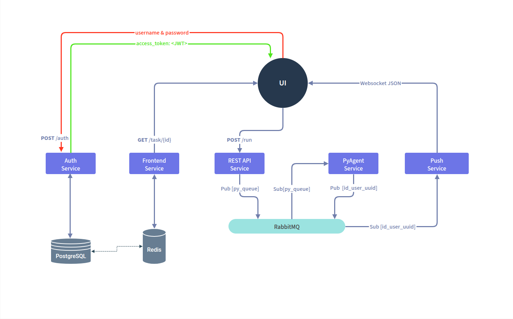

# Code Runner 

Миссия проекта **Code Runner**  — предоставить платформу, где студенты могут совершенствовать свои навыки программирования посредством решения различных задач на разных языках программирования.

## Поддержа языков

Платформа поддерживает 1 язык программирования Python.

## Дизайн системы

## Рабочие Endpoints:

### Frontend Service

- `GET /task/{id}` \- Получить задачу по UUID

### REST API Service

- `POST /run` \-  Отправить код на проверку
